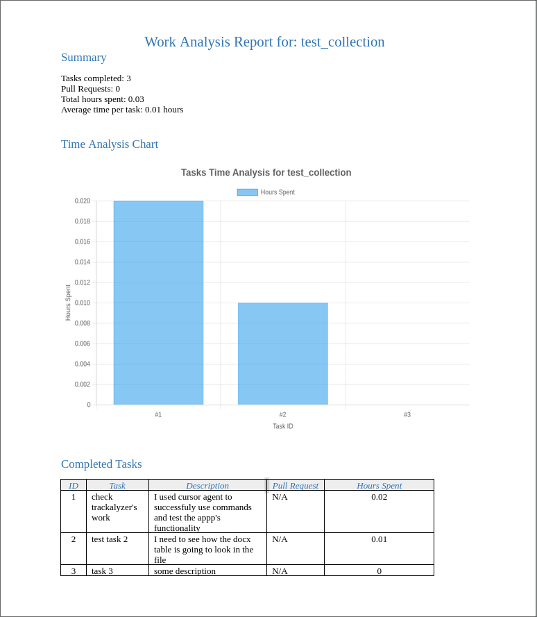

# Trackalyzer

A command-line application for tracking and analyzing work during production practice with a local SQLite database.

## Installation

```bash
# Clone the repository
git clone https://github.com/yourusername/trackalyzer.git
cd trackalyzer

# Install dependencies
npm ci 

# Build the project
npm run build

# Link the CLI globally (optional)
npm link
```

## Usage

The application provides commands to manage collections and tasks, and to generate reports.

### Collection Commands

Collections are used to group related tasks.

```bash
# Create a new collection
trackalyzer collection create

# List all collections
trackalyzer collection list

# Choose an active collection
trackalyzer collection choose

# Delete a collection
trackalyzer collection delete

# Analyze the current collection and generate a report
trackalyzer collection analyze
```

### Task Commands

Tasks represent work items that you track.

```bash
# Start a new task
trackalyzer task start

# Stop the current task
trackalyzer task stop

# Delete a task
trackalyzer task delete
```

## Usage Example

The project has a complete example scenario demonstrating how to use Trackalyzer to track work on a web development project. This interactive example guides you through each step of the workflow.

For detailed information and instructions, check out the [Example Usage Guide](examples/README.md).


A screenshot of docx example


Example Time Analysis Chart in png


## Features

- Create, list, choose, and delete work collections
- Start, stop, and delete tasks within collections
- Track time spent on tasks
- Link tasks to pull requests
- Generate analysis reports in DOCX or Markdown format
- Visualize time spent with charts

## Data Model

### Collections

Collections organize groups of related tasks.

```
collections {
	id: AUTOINCREMENT,
	name: STRING REQUIRED,
}
```

### Tasks

Tasks represent work items with tracking metadata.

```
tasks {
	id: AUTOINCREMENT,
	collection_id: INTEGER NOT NULL,
    name: String Required,
	description: String Required, 
	pull_request: String,
	start_time: TIMESTAMP DEFAULT CURRENT_TIME,
	finish_time: TIMESTAMP
}
```

## Generated Reports

Reports are stored in the `reports` directory by default, with each collection getting its own subdirectory.

Reports include:
- A summary of completed tasks
- Number of tasks and pull requests
- Total hours spent
- Average time per task
- A chart visualization of task durations
- A detailed table of all tasks

## Roadmap and Tasks

The following tasks are planned for future development:

### Completed
- ✅ Create a TypeScript project structure with configuration
- ✅ Implement SQLite database for persistent storage
- ✅ Create models for collections and tasks
- ✅ Build a command-line interface using Commander.js
- ✅ Implement Markdown reporting with chart generation
- ✅ Implement DOCX reporting with chart generation
- ✅ Add interactive prompts using Inquirer.js
- ✅ Create a dedicated reports directory structure
- ✅ Add data visualization with charts

### In Progress
- 🔄 Fix DOCX table formatting issues (various approaches tried but none fully successful)

### Planned

- 📋 Fix docx formatting: currently it can't set columns width properly
- 📋 Implement `task list` to display all tasks in a collection
- 📋 Add configuration options for default report directory
- 📋 Implement export/import functionality for backing up data
- 📋 Add filtering options for report generation
- 📋 Create a simple web dashboard for viewing reports
- 📋 Add user authentication for multi-user support

## Project Structure

```
trackalyzer/
├── data/               # Database and application state
│   ├── store.json     # Current collection state
│   └── trackalyzer.db # SQLite database
├── reports/           # Generated reports and charts
│   └── Collection_Name/ # Each collection has its own subfolder
├── src/               # Source code
└── dist/              # Compiled JavaScript
```

## License

MIT